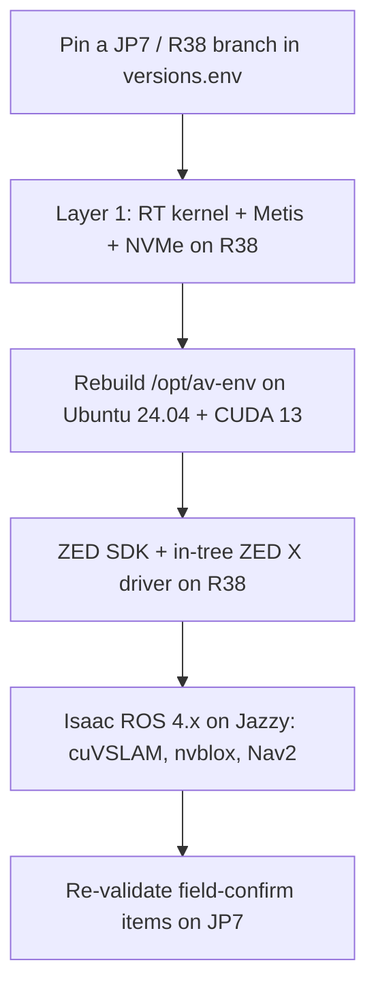

# Roadmap: JetPack 7 / Jazzy
{: .no_toc }

This stack is pinned to JetPack 6.2 / L4T R36.4.3 because that is the platform NVIDIA validates Isaac ROS 3.2 (Humble) against. This page tracks the migration path to the next generation. It is a plan, not a shipped configuration: every item below is unverified on JetPack 7 until proven on hardware.

1. TOC
{:toc}

---

## Why not jump now

Isaac ROS 4.x (latest 4.4.0, April 2026) targets ROS 2 **Jazzy**, Ubuntu 24.04, JetPack 7.x (L4T R38), and CUDA 13. Moving the whole stack forward is not a version bump. It changes the kernel branch, the rootfs Ubuntu release, the CUDA major, the ROS distro, and every vendor SDK at once. None of the Layer 2 vendor pieces (ZED SDK, Voyager SDK, the in-tree drivers) are confirmed on that combination here.

Layer 1 (the PREEMPT_RT kernel, Metis NPU, NVMe root, and Wi-Fi) has no Isaac ROS dependency, so it is the first thing to port. On the current JetPack 6.2 baseline the RT kernel, Metis inference, ZED X camera, NVMe root, and MAXN_SUPER power mode are verified live on the board (2026-06-11), with measured throughput in [Benchmarks]({{ '/BENCHMARKS' | relative_url }}). Wi-Fi drivers (rtw88 / RTL8822CE) and the NetworkManager profile are staged by the bake. The R38 port must re-establish each of these from scratch.

## Blocking items

| Item | Question | Status |
|---|---|---|
| L4T R38 kernel branch | Does `generic_rt_build.sh` still apply cleanly, and what is the new vermagic? | unverified |
| Ubuntu 24.04 rootfs | Glibc / toolchain bump; rebuild of `/opt/av-env` | unverified |
| CUDA 13 | OpenCV-CUDA `CUDA_ARCH_BIN`, TensorRT, VPI versions | unverified |
| ZED SDK on JP7 | 5.3 lists a JP7 beta; encode/decode noted as not functional | partial |
| Voyager SDK on JP7 | aarch64 wheels and the Metis driver against the R38 kernel | unverified |
| Isaac ROS 4.x | Jazzy packages; `isaac_ros_manipulation` rename and other API moves | tracked upstream |

## Migration order

The plugin system and the `versions.env` single-source-of-truth model are built for exactly this: a JP7 branch is a new pin set plus per-component vendor-tree updates, not a rewrite. The consistency linter ([check_version_consistency.sh](../scripts/check_version_consistency.sh)) keeps the docs honest across the move by failing CI on any version that drifts from the pins. The field-confirm items to re-validate in the final step are tracked in [Field Confirm Results]({{ '/FIELD_CONFIRM_RESULTS' | relative_url }}).

## What stays the same

- The five numbered build phases and the Makefile surface.
- The plugin architecture (`plugins/axelera`, `plugins/zedx`).
- Vermagic discipline: in-tree driver promotion plus a matching `linux-headers-*.deb`, and the vermagic gate that aborts the flash if any module disagrees with the kernel.
- The fleet and golden-image workflow.

## What changes

- Kernel branch, rootfs Ubuntu release, CUDA major, ROS distro.
- Every vendor SDK version pin.
- The validated-platform column in [Compatibility]({{ '/COMPATIBILITY' | relative_url }}).
