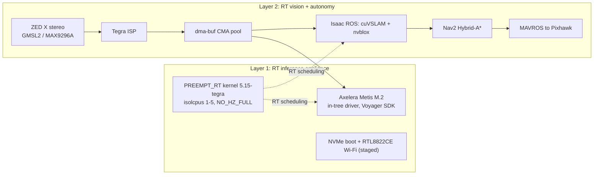
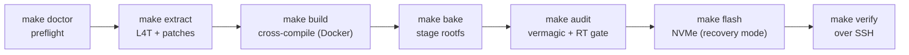

# jetson-rt-stack
{: .fs-9 }

PREEMPT_RT firmware for the Jetson Orin NX 16GB. Axelera Metis inference, ZED X stereo, Isaac ROS autonomy. One reproducible build, deterministic latency, fleet deploy.
{: .fs-5 .fw-300 }

[](https://github.com/silicondoritos/jetson-rt-stack/blob/main/LICENSE)
[]({{ '/COMPATIBILITY' | relative_url }})
[]({{ '/COMPATIBILITY' | relative_url }})
[]({{ '/VERMAGIC_STRATEGY' | relative_url }})
[](https://silicondoritos.github.io/jetson-rt-stack/)

[Quickstart]({{ '/QUICKSTART' | relative_url }}){: .btn .btn-primary .fs-5 .mb-4 .mb-md-0 .mr-2 }
[Compatibility]({{ '/COMPATIBILITY' | relative_url }}){: .btn .fs-5 .mb-4 .mb-md-0 .mr-2 }
[GitHub](https://github.com/silicondoritos/jetson-rt-stack){: .btn .fs-5 .mb-4 .mb-md-0 }

The build is two independent layers. Layer 1 is a complete RT inference appliance. Layer 2 adds vision, autonomy, and field hardening on top. Stop at Layer 1 if all you need is Metis inference on an NVMe-booted Jetson. This page is the hub: live status, hardware, the two-layer model, and a [grouped map of every doc](#documentation).

{: .note }
> **Who this is for.** Engineers bringing a Jetson Orin NX 16GB up as a real-time inference or autonomy appliance. Host requirements: Ubuntu 20.04 or 22.04 (the kernel build runs in a 22.04 container), 8 GB+ RAM (16 GB+ recommended), 40 GB+ free disk (100 GB+ recommended), and a direct USB-C link to the Jetson (no hubs). Full prerequisites in the [Quickstart]({{ '/QUICKSTART' | relative_url }}).

## At a glance

| | |
|---|---|
| Module | Jetson Orin NX 16GB (P3767-0000) on a P3768 Orin Nano devkit carrier |
| Platform | L4T R36.4.3 / JetPack 6.2, kernel 5.15-tegra (PREEMPT_RT) |
| RT target | cyclictest p99 max < 100 µs on isolated cores 1-5 |
| CPU isolation | cores 1-5 (`isolcpus`/`nohz_full`/`rcu_nocbs`); core 0 reserved |
| Zero-copy | 256 MB device-tree CMA dma-buf pool (per-device CMA regions deferred to Layer 2), ZED X to Tegra ISP to Metis by FD |
| Accelerator | Axelera Metis M.2, PCIe Gen3 x4 (`1f9d:1100`) |
| Camera | Stereolabs ZED X, 2x 1920x1200 global shutter @ 60 fps |
| Autonomy | ROS 2 Humble + Isaac ROS 3.2 + Nav2 (Hybrid-A*) |
| Power modes | MAXN_SUPER (mode 0, 157 TOPS) plus fixed budgets 10/15/25/40 W (super conf table) |
| Build time | ~90 min, clean Ubuntu 22.04 host to flashed Jetson |

## Status

Everything below is live-verified over SSH on the running board (last confirmed 2026-06-11); the remaining open items (fleet flow, sustained HV-rail test) are tracked in [Field confirm results]({{ '/FIELD_CONFIRM_RESULTS' | relative_url }}):

| Capability | Status | Evidence on device |
|---|---|---|
| PREEMPT_RT kernel | Verified | `uname -v` shows `SMP PREEMPT_RT`; `/sys/kernel/realtime` = 1 |
| Axelera Metis NPU | Verified | enumerated at PCIe `0004:01:00.0` (`1f9d:1100`), bound to the `metis` driver; live inference at 49.2 FPS end-to-end (1080p video, 13.7% CPU) |
| NVMe root | Verified | rootfs on `/dev/nvme0n1p1` (ADATA XPG GAMMIX S55 2 TB) |
| MAXN_SUPER power | Verified | nvpmodel mode 0 (super conf table), 8 cores online, CPU max ~1.98 GHz |
| ZED X camera | Verified | end-to-end capture verified live: pyzed opens the camera (HD1200@30), 29.5 FPS stereo, CUDA depth maps; needs the SPSC/daemon pieces from `scripts/install_zedx_daemons.sh` |

Headline measured numbers, every one taken on the reference device
(the two C++ rows are reproducible with the bench harness in
[Benchmarks]({{ '/BENCHMARKS' | relative_url }}); run commands for the
rest are in [Samples & Tests]({{ '/SAMPLES' | relative_url }})):

| Measurement | Result |
|---|---|
| Metis inference, Python (`inference.py`, 1080p video) | 49.2 FPS end-to-end at 13.7% CPU |
| C++ live camera, detector only (`zedx_metis_infer`) | 37 to 92 FPS, depending on model and camera mode |
| C++ sensor fusion, all features (`zedx_metis_fusion`) | 46 to 53 FPS with `--depth-every` 3 to 6 (yolov8s) |
| ZED X stereo + CUDA depth, Python | 29.5 FPS at HD1200@30 |
| cyclictest on isolated cores | avg ~3 µs (max < 100 µs requires a headless run) |
| Power-on to sshd | ~60 s |

The `/opt/av-env` Python environment (PyTorch, Voyager SDK 1.6.1 wheels) is provisioned on the reference device and the `make verify` venv import check passes; on a fresh unit the first-boot service provisions it once the device has internet. Run commands and expected outputs for every demo are in [Samples & Tests]({{ '/SAMPLES' | relative_url }}); the C++ pipeline is documented in [ZED X + Metis C++]({{ '/ZEDX_METIS_CPP' | relative_url }}). The remaining field-validation items are tracked in [Field confirm results]({{ '/FIELD_CONFIRM_RESULTS' | relative_url }}).

---

## What it builds



The Layer 2 capture path is designed to be DMA only: ZED X writes into a CMA dma-buf, the Tegra ISP debayers in place, and both the Metis NPU and the SLAM nodes import the same buffer by file descriptor, with no CPU memcpy on the hot path. The camera path is verified live (2026-06-11), but the zero-copy property itself remains a design goal: NVMM/dmabuf caps do not negotiate into the Axelera GStreamer elements on this Voyager build, so frames currently cross through CPU copies. See [DMABUF zero-copy]({{ '/DMABUF_ZEROCOPY' | relative_url }}).

## Build pipeline



`versions.env` is the single source of truth for every pinned version, URL, and hardware ID. `make menuconfig` (Kconfig) selects features. A plugin system injects the vendor drivers. See [Automation]({{ '/AUTOMATION' | relative_url }}) and [Configuration]({{ '/CONFIGURATION' | relative_url }}).

---

## Layer 1: baseline (Phases 1 to 4)

Complete on its own. No camera or ROS required. `make verify` passing means the Jetson is ready for Metis inference; its venv import check passes only after the first-boot service has provisioned `/opt/av-env`, which requires the device to be online once.

- **PREEMPT_RT kernel**: `NO_HZ_FULL`, CPU isolation on cores 1 to 5, threaded IRQs, RCU NOCB offload. Target p99 max under 100 µs on isolated cores. See [RT tuning]({{ '/RT_KERNEL_OPTIMIZATION' | relative_url }}).
- **Axelera Metis M.2**: in-tree driver (vermagic-safe), PCIe link-training patience patch, udev rules, Voyager SDK 1.6 pip wheels installed into `/opt/av-env` by the first-boot service once the device has internet.
- **NVMe boot**: M.2 Key M slot via `flash_l4t_t234_nvme.xml`.
- **Realtek RTL8822CE**: M.2 Key E Wi-Fi/BT. The vendor driver is staged but blacklisted from boot-time autoload (set `WIFI_AUTOLOAD=1` at bake to opt in), and a NetworkManager profile is staged. Bring-up: `sudo modprobe rtl8822ce`.
- **Per-boot RT tuning**: `jetson-rt-tune.service` locks clocks, pins IRQs, sets the performance governor.
- **Vermagic discipline**: in-tree build plus a matching `linux-headers-*.deb` so no out-of-tree module loads against the wrong ABI.

## Layer 2: RT vision extension (Phases 5 to 7, all optional)

Each phase is independently opt-in on top of Layer 1. Phase 5 (OpenCV-CUDA, ROS 2 + Isaac ROS, ZED X capture, Metis inference) is installed and verified live on the reference device (2026-06-11). See RUNBOOK R18 for the replication sequence. Phase 6 (fleet manufacturing) ships as scripts and remains unexercised; Phase 7's resilience services (black-box, brownout guard, PCIe AER monitor, data partition) are installed and active on the reference device (2026-06-11).

- **ZED X stereo camera**: in-tree `sl_zedx.ko`, MAX9296A deserializer enforced (MAX96712 disabled to prevent silent stereo corruption). The device-tree overlay loads at boot; the ZED SDK 5.3 userspace is a separate on-device install. Driver source is gated by a Stereolabs agreement. End-to-end verified live (2026-06-11): pyzed opens the camera (HD1200@30), 29.5 FPS stereo sustained, CUDA depth maps, after `scripts/install_zedx_daemons.sh` installs the BMI088/SPSC IMU modules, vendor daemons, and patched `libnvisppg.so` (see DRIVERS.md §1.4-1.5).
- **C++ camera-to-NPU samples**: a lean detector (`zedx_metis_infer`, 37 to 92 FPS on the live camera) and a full sensor-fusion app (`zedx_metis_fusion`: detection + stereo depth + skeletons + IMU pose + tracking, 46 to 53 FPS with all features via the `--depth-every` cadence, NVENC `--record`). See [ZED X + Metis C++]({{ '/ZEDX_METIS_CPP' | relative_url }}) and the measured dataset in [Benchmarks]({{ '/BENCHMARKS' | relative_url }}).
- **DMABUF zero-copy**: ZED X to Tegra ISP to CMA to Metis by dma-buf FD, no CPU memcpy on the hot path (design goal: not yet achieved on this Voyager build, see [DMABUF zero-copy]({{ '/DMABUF_ZEROCOPY' | relative_url }})).
- **OpenCV 4.10 with CUDA**: built against CUDA 12.6, cuDNN 9.3, `CUDA_ARCH_BIN=8.7` (sm_87, Orin Ampere). Cached `.deb` for units 2 to N. Stock `apt python3-opencv` ships without CUDA.
- **ROS 2 Humble + Isaac ROS 3.2 + Nav2**: cuVSLAM visual SLAM, nvblox 3D occupancy, Hybrid-A* planning, pinned to isolated cores. JetPack 6.2 is the validated platform for this line. See [Compatibility]({{ '/COMPATIBILITY' | relative_url }}).
- **Platform hardening**: systemd watchdog, persistent journald, chrony, SSH/UFW hardening, Metis brownout guard, PCIe AER monitor, per-flight black-box recorder.
- **Fleet manufacturing**: build once, flash N units with unique identities, or clone a golden image for bit-identical redeploy.

---

## Real-time targets

{: .important }
> **The RT contract.** PREEMPT_RT kernel on isolated cores 1-5, with nvpmodel mode 0 (MAXN_SUPER on the super conf table) and `jetson_clocks` locked.
>
> - **Latency**: cyclictest p99 max **< 100 µs** on cores 1-5 (measured avg ~3 µs; see [Samples & Tests]({{ '/SAMPLES' | relative_url }})).
> - **Isolation**: cores 1-5 carry the RT workload (`isolcpus=1-5 nohz_full=1-5 rcu_nocbs=1-5`); core 0 keeps the OS and IRQs.
> - **Memory**: a single **256 MB** CMA dma-buf pool (device-tree `linux,cma` node; the 2048 MB defconfig value does not size the pool on this board). Metis inference and ZED X capture both run on the board today; true shared dma-buf zero-copy between them remains a design goal (see [DMABUF zero-copy]({{ '/DMABUF_ZEROCOPY' | relative_url }})). Per-device CMA regions are a deferred Layer 2 refinement, see [Fine-tuning]({{ '/FINE_TUNING' | relative_url }}) §7.
> - **Swap**: ZRAM/ZSWAP are off by design (no compressed-swap jitter in the RT path) and the baked image ships with no swap. For heavy on-device CUDA builds, add a low-swappiness NVMe swapfile: recipe in [Troubleshooting]({{ '/TROUBLESHOOTING' | relative_url }}#b-7-cuda-pip-builds-mmcv-get-oom-killed).
>
> The < 100 µs figure is a **10-second smoke test**, not a production spec. Real deployments should run cyclictest for at least 30 minutes at operating temperature under full mission load. See [RT tuning]({{ '/RT_KERNEL_OPTIMIZATION' | relative_url }}).

## Hardware

| Component | Part | Layer |
|---|---|---|
| Module | Jetson Orin NX 16GB (P3767-0000) | 1 |
| Carrier | P3768 Orin Nano devkit carrier (reference); set `TARGET_BOARD` in `versions.env` for other carriers | 1 |
| Board target | `jetson-orin-nano-devkit` (correct for Orin NX 16GB, see below) | 1 |
| AI accelerator | Axelera Metis M.2, PCIe Gen3 x4, `1f9d:1100` | 1 |
| Storage | NVMe SSD, M.2 Key M | 1 |
| Wi-Fi/BT | Realtek RTL8822CE, M.2 Key E | 1 |
| Recovery USB | NVIDIA APX `0955:7323` | 1 |
| Camera | Stereolabs ZED X via ZED Link Mono (MAX9296A GMSL2) | 2 |
| Flight controller | Pixhawk on `/dev/ttyTHS1` at 921600 (MAVROS) | 2 |

{: .important }
> **Board target: why an Orin NX 16GB uses `jetson-orin-nano-devkit`.**
> `jetson-orin-nano-devkit` is the flash config for the **P3768 carrier** (a symlink to `p3768-0000-p3767-0000-a0.conf` in L4T R36.4.3), not for a module. The P3768 carrier accepts every P3767 module (Orin NX 16GB/8GB, Orin Nano 8GB/4GB); NVIDIA named the kit after the carrier. Do **not** use `jetson-orin-nano-devkit-super`: that bundles the Orin Nano power table and misconfigures the NX. Super Mode is a runtime `nvpmodel` change, not a flash config.

{: .note }
> **Power modes.** Two separate axes both rise with Super Mode: power budget (W) and compute (TOPS).
> - **MAXN_SUPER** (nvpmodel mode 0 on the super conf table): unconstrained super profile, 157 TOPS sparse-INT8. Fixed-budget profiles: 4=40W, 3=25W, 2=15W, 1=10W.
> - The old standard-conf numbering (0=MAXN 25W) does not apply: the flash installs the super conf as the default table.
>
> Read exact per-mode wattages from `nvpmodel --available` on your carrier. Validate the carrier HV rail before enabling 40 W: [Field Confirm Results]({{ '/FIELD_CONFIRM_RESULTS' | relative_url }}) §3.6, audited in [Verification report]({{ '/VERIFICATION_REPORT' | relative_url }}) §1.10.

## Quick start

```bash
git clone https://github.com/silicondoritos/jetson-rt-stack.git
cd jetson-rt-stack

# stage L4T tarballs and vendor trees next to the repo (see Quickstart + Third-party)

pip install kconfiglib       # host dep for make menuconfig
make defconfig               # apply committed defaults (or: make menuconfig)

make doctor                  # preflight; fix any red
make docker-build            # one-time (~5 min)

# one-command path: make ignite = doctor -> all -> audit -> flash -> verify
# (pauses once for recovery mode); or step by step:
make all                     # extract, build, bake (~45 to 90 min)
make audit                   # refuses to proceed if anything is red

# put Jetson in APX recovery mode (short REC+GND, plug USB-C)
make flash                   # ~20 min; auto-detects USB ID 0955:7323

# remove recovery jumper, power-cycle; boot to sshd takes ~60 s (blank HDMI during
# boot is normal; judge boot by USB gadget 0955:7020, then ping 192.168.55.1, then ssh)
# first-boot provisions /opt/av-env only when the device has internet; the service
# re-runs each boot until provisioning completes
make verify                  # post-flash checks over SSH; the venv import check
                             # fails until /opt/av-env is provisioned online
```

Roughly 90 minutes from a clean Ubuntu 22.04 host to a flashed, SSH-reachable Jetson.

---

## Documentation

The docs, grouped by reader journey.

**Start here**

- [Quickstart]({{ '/QUICKSTART' | relative_url }}): clean host to flashed Jetson in 90 minutes.
- [Full tutorial]({{ '/COMMUNITY_POST' | relative_url }}): the long-form bring-up guide, every command and every gotcha.
- [Compatibility]({{ '/COMPATIBILITY' | relative_url }}): the pinned version matrix and what each is validated against.
- [Third-party dependencies]({{ '/THIRD_PARTY' | relative_url }}): every external input (tarballs, NDA vendor trees, wheels, apt repos), where from, where it goes.

**Build**

- [Configuration]({{ '/CONFIGURATION' | relative_url }}): `make menuconfig`, the plugin system, named profiles.
- [Build]({{ '/BUILD' | relative_url }}): Phases 1 to 2, reproducibility.
- [Flash]({{ '/FLASH' | relative_url }}): Phase 4, recovery mode.
- [Automation]({{ '/AUTOMATION' | relative_url }}): Makefile, scripts, `versions.env`.
- [Kernel patches]({{ '/KERNEL_PATCHES' | relative_url }}): every patch and in-tree integration.
- [Kernel options]({{ '/KERNEL_OPTIMIZATIONS' | relative_url }}): every `CONFIG_*` flag and its rationale.
- [RT tuning]({{ '/RT_KERNEL_OPTIMIZATION' | relative_url }}): PREEMPT_RT, cyclictest, CPU isolation.
- [Fine-tuning]({{ '/FINE_TUNING' | relative_url }}): cross-component coordination (power, storage, CPU map, CMA strategy).
- [Vermagic]({{ '/VERMAGIC_STRATEGY' | relative_url }}): why a custom kernel rejects vendor modules, and how this build prevents it.
- [DMABUF zero-copy]({{ '/DMABUF_ZEROCOPY' | relative_url }}): the kernel bridge, tracepoints, and the remaining zero-copy gap.

**Drivers**

- [Drivers]({{ '/DRIVERS' | relative_url }}): ZED X, ZED SDK, Metis, Voyager SDK.
- [CUDA libraries]({{ '/CUDA_LIBS' | relative_url }}): OpenCV-CUDA, OpenGL/EGL, TensorRT, VPI.

**Run it**

- [Samples & Tests]({{ '/SAMPLES' | relative_url }}): every gauntlet, camera sample, and inference demo, with expected outputs.
- [ZED X + Metis C++]({{ '/ZEDX_METIS_CPP' | relative_url }}): the detector and sensor-fusion samples, `--depth-every` tuning, NVENC `--record`.
- [Benchmarks]({{ '/BENCHMARKS' | relative_url }}): measured throughput, GPU load, power, and thermals; regenerate with `scripts/bench_zedx_metis.sh`.
- [AV stack]({{ '/AV_STACK' | relative_url }}): ROS 2, Isaac ROS, cuVSLAM, nvblox, Nav2.

**Operations**

- [Runbook]({{ '/RUNBOOK' | relative_url }}): decision trees for repeat deploys and recovery.
- [Operations]({{ '/OPERATIONS' | relative_url }}): day-2 operator guide — clock/Metis golden rule, SSH access, GUI/headless toggle, NPU/Wi-Fi/USB-C checks, boot recovery (ships on-device as `~/README.md`).
- [Platform resilience]({{ '/UAV_RESILIENCE' | relative_url }}): watchdog, journald, chrony, brownout guard, PCIe AER.
- [Black-box]({{ '/BLACKBOX' | relative_url }}): hash-chained event log plus NVENC ROS bag.
- [Data partition]({{ '/DATA_PARTITION' | relative_url }}): btrfs, zstd, scrub.
- [Telemetry failover]({{ '/TELEMETRY_FAILOVER' | relative_url }}): MAVLink, MAVROS, Iridium satellite fallback.
- [Fleet manufacturing]({{ '/FLEET' | relative_url }}): release tarballs, batch flash, audit trail.
- [Golden image]({{ '/GOLDEN_IMAGE' | relative_url }}): capture and redeploy a customized Jetson.

**Reference & records**

- [Troubleshooting]({{ '/TROUBLESHOOTING' | relative_url }}): symptom-first failure catalog.
- [Verification framework]({{ '/VERIFICATION' | relative_url }}): the `step::run` pre/post-gate model.
- [Verification report]({{ '/VERIFICATION_REPORT' | relative_url }}): every magic value traced to a vendor source.
- [Field confirm results]({{ '/FIELD_CONFIRM_RESULTS' | relative_url }}): the field-validation log, claim by claim.
- [NVIDIA references]({{ '/NVIDIA_REFERENCES' | relative_url }}): annotated vendor bibliography.
- [Roadmap: JetPack 7 / Jazzy]({{ '/ROADMAP_JP7' | relative_url }}): the forward path to Isaac ROS 4.x.

---

## License

[Apache 2.0](https://github.com/silicondoritos/jetson-rt-stack/blob/main/LICENSE).

## Acknowledgments

Axelera (bring-up guide and `axl-jetson.patch`), the NVIDIA Jetson Linux team (L4T R36.4.3 and public sources), Stereolabs (ZED X / ZED Link Mono), and the Linux kernel and PREEMPT_RT communities.
